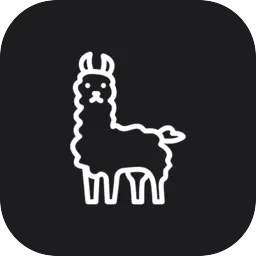

<table border="0" cellspacing="0" cellpadding="0">
  <tr>
    <td width="50%" valign="top">
      
 <strong><a href="https://sonto.tech/druck">Druck</a></strong> Structured JSON in, magazine pages out.

    </td>
    <td width="50%" valign="top">
      
 <strong><a href="https://artttj.de/llama-smith/">Llama Smith</a></strong> Repo forensics forged into a Claude Code skill.

    </td>
  </tr>

  <tr>
    <td width="50%" valign="top">
      
 <strong><a href="https://github.com/artttj/llama-review">Llama Review</a></strong> Multi-model code review swarm.

    </td>
    <td width="50%" valign="top">
      
 <strong><a href="https://sonto.space/steve/">Llama Steve</a></strong> Your roadmap has 1,000 ideas. He ships 3, kills the rest.

    </td>
  </tr>

  <tr>
    <td width="50%" valign="top">
      
 <strong><a href="https://sonto.space">Sonto Space</a></strong> Minimal writing space.

    </td>
    <td width="50%" valign="top">
      
 <strong><a href="https://github.com/artttj/rapid-stack">Rapid Stack</a></strong> Curated skills for rapid development.

    </td>
  </tr>

  <tr>
    <td width="50%" valign="top">
      
 <strong><a href="https://sonto.tech">Sonto News</a></strong> Tech news curated by AI agents.

    </td>
    <td width="50%" valign="top">
      
 <strong><a href="https://github.com/artttj/nemo">Nemo</a></strong> Passwords never leave your device.

    </td>
  </tr>

  <tr>
    <td width="50%" valign="top">
      
 <strong><a href="https://chromewebstore.google.com/detail/noto/oddalendfcaonkemohpokibgndnnogag">Noto</a></strong> Clipboard history and prompt shelf.

    </td>
    <td width="50%" valign="top">
      
 <strong><a href="https://chromewebstore.google.com/detail/njdfdfhcnlfkigkppnhbihlidjmiepfb">Sentō</a></strong> AI writing layer for any web interface.

    </td>
  </tr>

  <tr>
    <td width="50%" valign="top">
      
 <strong><a href="https://chromewebstore.google.com/detail/synto/fimopaolcnmojcdilinhmhnnbnnnkhjh">Synto</a></strong> Web to structured data for LLM pipelines.

    </td>
    <td width="50%" valign="top"></td>
  </tr>
</table>
